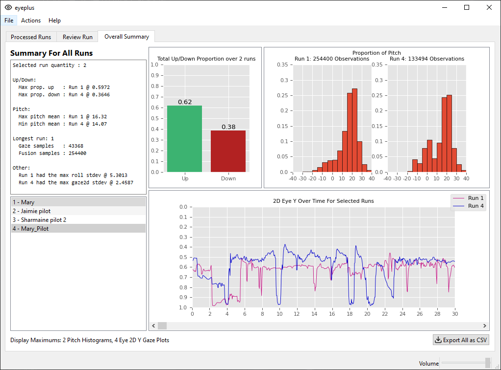

# eyeplus

eyeplus reads raw Tobii Pro 3 Glasses data to determine how much time a user spends looking at the horizon versus obstacles in their path.

## Description

Data can be imported from either a zip file or folder structure. It is then automatically ingested and processed. From there, you can look at a general overview of each run, review a live playback with cumulative visuals, or see the overall results. The processed data can also be exported in a standard csv format, so that it may be imported into other data analysis software.

## Screenshots

### Summary Tab


### Review Tab


### Overall Tab



## Installation

You may install either using the binary Windows installer, available under releases, or from source. If you choose to use the installer, all required software packages are included, and you simply need to follow along.

### Hardware Requirements

- Quad-Core x86_64 Processor
- 6 GiB RAM
- 720p+ Display (1080p recommended)

#### How To Install From Source

1. Ensure you have Python 3.11+ installed.
2. If you are using Linux, make you sure have the mpv library installed. On Debian, this is included in the `mpv-dev` package.
3. Clone this repository: `git clone https://github.com/starshine-bcit/eyeplus`.
4. Create and activate a virtual environment using Python 3.11+.
5. Install all required PyPi packages: `python3 -m pip install -r requirements.txt`

## Usage

To run from source, simply do `python3 ./src/eyeplus.py`. If you used the installer, simply click the desktop icon that was created for you.

For instructions on how to operate the software, please see the [detailed usage instructions](docs/usage.md).

## Transferring Data

If you would like to move your data to another system or install, simply copy over the `./data` folder. If that folder exists in the destination already, it is suggested that you fully delete it before proceeding.

## Uninstalling

If you installed from source, simply delete the entire project directory structure. If you used the installer, then locate the files PATH HERE and delete them, alongside the desktop shortcut.

## Acknowledgements

### Qt

This project uses open-source tools and libraries from the Qt Project to generate a GUI, in accordance with the GPLv3 License.

### Lucide

eyeplus's icons are created and maintained by the [lucide community](https://github.com/lucide-icons/lucide).  
They are distributed under the ISC License, as follows:

```
ISC License

Copyright (c) for portions of Lucide are held by Cole Bemis 2013-2022
as part of Feather (MIT). All other copyright (c) for Lucide are held
by Lucide Contributors 2022.

Permission to use, copy, modify, and/or distribute this software for any
purpose with or without fee is hereby granted, provided that the above
copyright notice and this permission notice appear in all copies.

THE SOFTWARE IS PROVIDED "AS IS" AND THE AUTHOR DISCLAIMS ALL WARRANTIES
WITH REGARD TO THIS SOFTWARE INCLUDING ALL IMPLIED WARRANTIES OF
MERCHANTABILITY AND FITNESS. IN NO EVENT SHALL THE AUTHOR BE LIABLE FOR
ANY SPECIAL, DIRECT, INDIRECT, OR CONSEQUENTIAL DAMAGES OR ANY DAMAGES
WHATSOEVER RESULTING FROM LOSS OF USE, DATA OR PROFITS, WHETHER IN AN
ACTION OF CONTRACT, NEGLIGENCE OR OTHER TORTIOUS ACTION, ARISING OUT OF
OR IN CONNECTION WITH THE USE OR PERFORMANCE OF THIS SOFTWARE.
```

### microfusion

Portions of the imu sensor data code are adapted from Peter Hinch's [micropython-fusion](https://github.com/micropython-IMU/micropython-fusion), which uses the [MIT license](https://github.com/micropython-IMU/micropython-fusion/blob/master/LICENSE).

### mpv

#### libmpv-2

eyeplus ships with a pre-compiled binary library (thanks [sinchiro!](https://sourceforge.net/projects/mpv-player-windows/files)) , and is being distributed here under the GPLv3 license. Details regarding mpv's licensing can be found [here](https://github.com/mpv-player/mpv/blob/master/Copyright).

#### mpv.py

eyeplus is also bundled with `mpv.py` from [python-mpv](https://github.com/jaseg/python-mpv), which inherits it's license from the base mpv project. It is also being distributed here under the GPLv3.

## License

This software is licensed under the GPLv3. The full text can be viewed in the LICENSE file or [here](https://www.gnu.org/licenses/gpl-3.0.txt).
