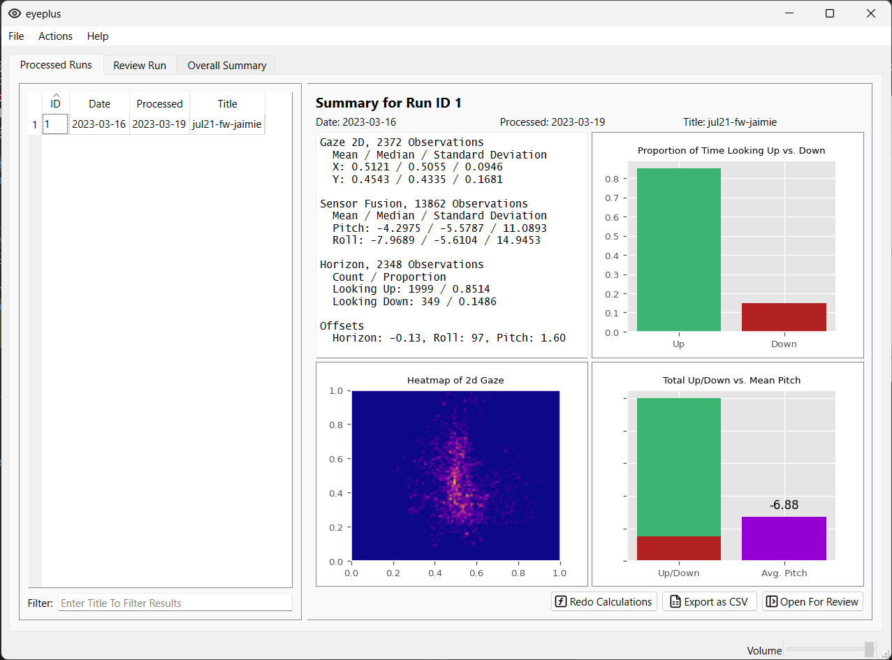
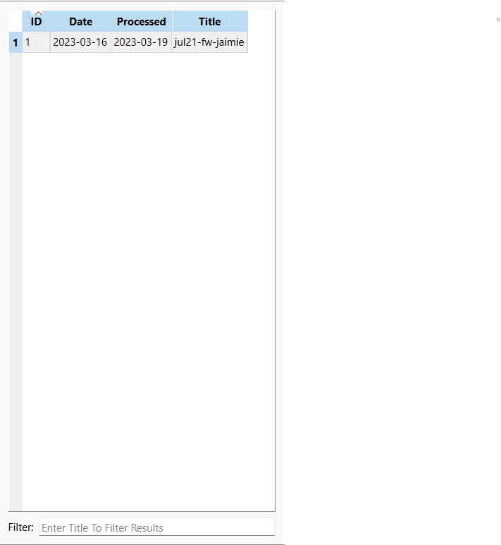
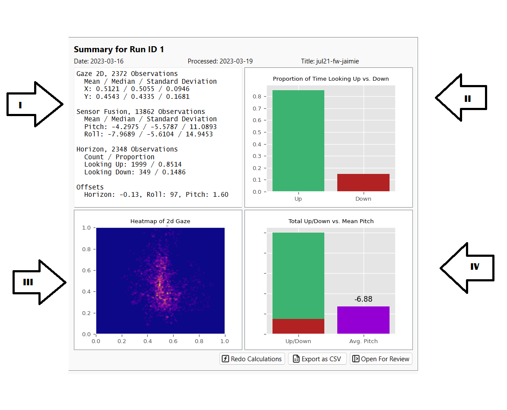
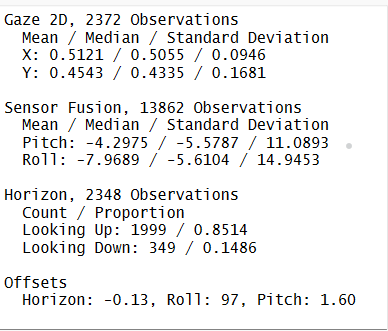
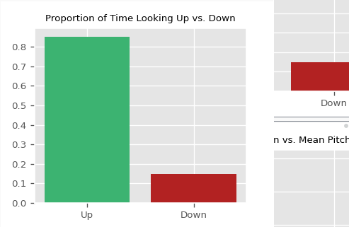
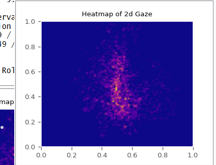
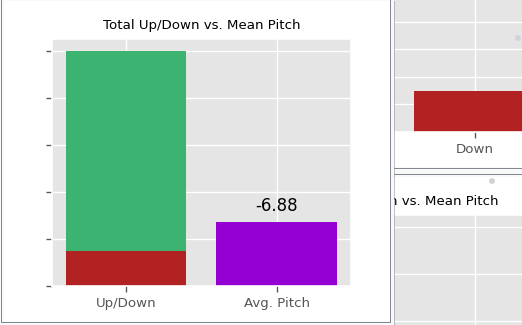
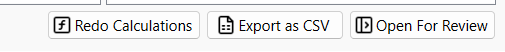

# Eyeplus

## Table of Contents

1. [Importing Data](#importing-data)
2. [Features](#features)
3. [Troubleshooting](#troubleshooting)

## Importing Data

To import data into Eyeplus, follow these steps:

1. Click on the "File" menu in the top-left corner of the main application window.
   
2. Select "Import Zip" or "Import Folder" from the dropdown menu.
   
3. Browse to the location of your data folder and select the folder.
   
4. Wait for the data ingestion process to complete.
5. Congratulations! You have successfully imported the data. The window will now open with the summary of the ingested data.
   

## Features

### Processed Run Tab

#### This section displays a list of processed Run IDs. You can easily sort the processed Run IDs according to the following criteria:

1. Run ID
2. Date of Recording
3. Processed Date
4. Title

To sort the list, simply click on the corresponding column header.

Additionally, use the filter search bar to find a specific title by entering keywords or phrases.

#### This window summarizes the currently selected Run ID

#### The first quadrant presents general statistics of the processed data. It offers the following insights:

1. **Gaze2D Data:**
   a. Mean, median, and standard deviation (SD) for the X-axis
   b. Mean, median, and SD for the Y-axis

2. **Pitch and Roll Data:**
   a. Mean, median, and SD for Pitch
   b. Mean, median, and SD for Roll

3. **Count and Proportion of Gaze Directions:**
   a. Actual number and proportion of instances when looking up
   b. Actual number and proportion of instances when looking down

#### The second quadrant displays a bar plot comparing the **Looking Up** and **Looking Down** data relative to the horizon. This visualization helps in understanding the distribution of gaze directions in the dataset.

#### The third quadrant presents a heatmap of the 2D Gaze data. Each point on the heatmap represents the location where the eyes were focused for each second, providing a visual representation of gaze concentration and distribution over time.

#### The fourth quadrant compares the **Up/Down** bar rectangle with the average pitch.

### The three buttons at the bottom right of this window serve the following functions:

1. **Redo Calculations:** Recalculates the data when offsets are redefined, ensuring accurate results based on the updated parameters.
2. **Export as CSV:** Exports the gaze data in CSV format, allowing you to save the file to a location of your choice.
3. **Open for Preview:** Opens the currently selected Run ID in the Review Run tab, which will be discussed in the subsequent section of the documentation.
   

## Troubleshooting
