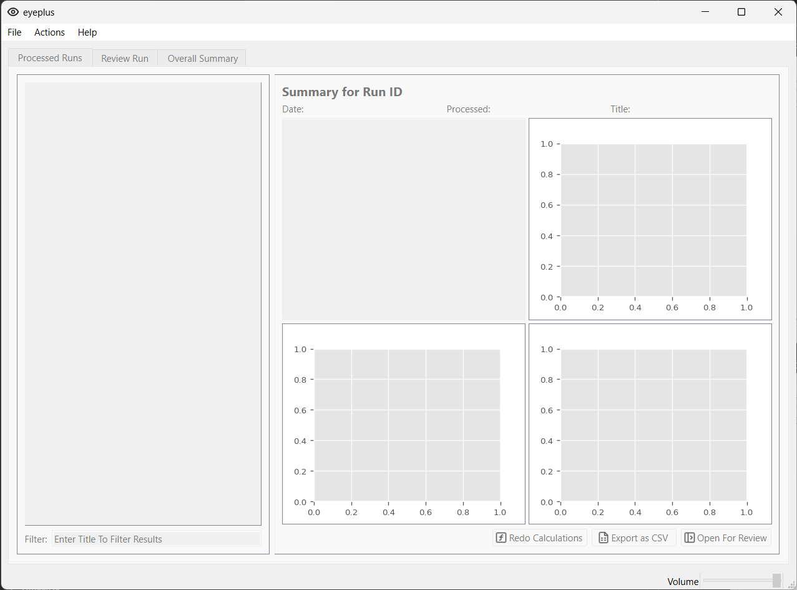
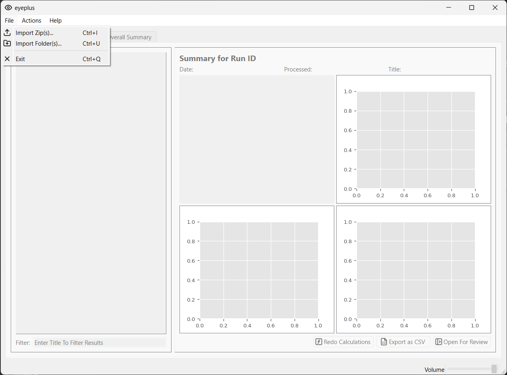
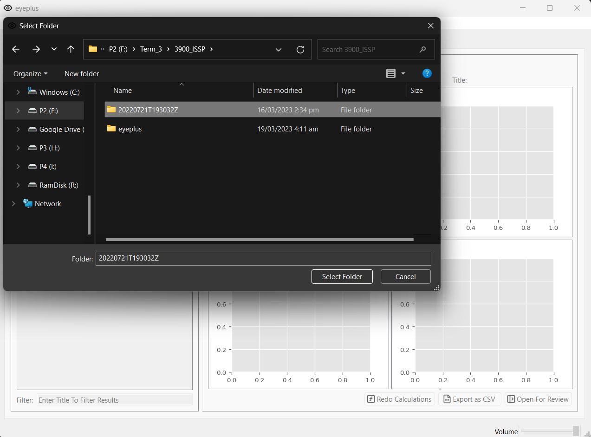
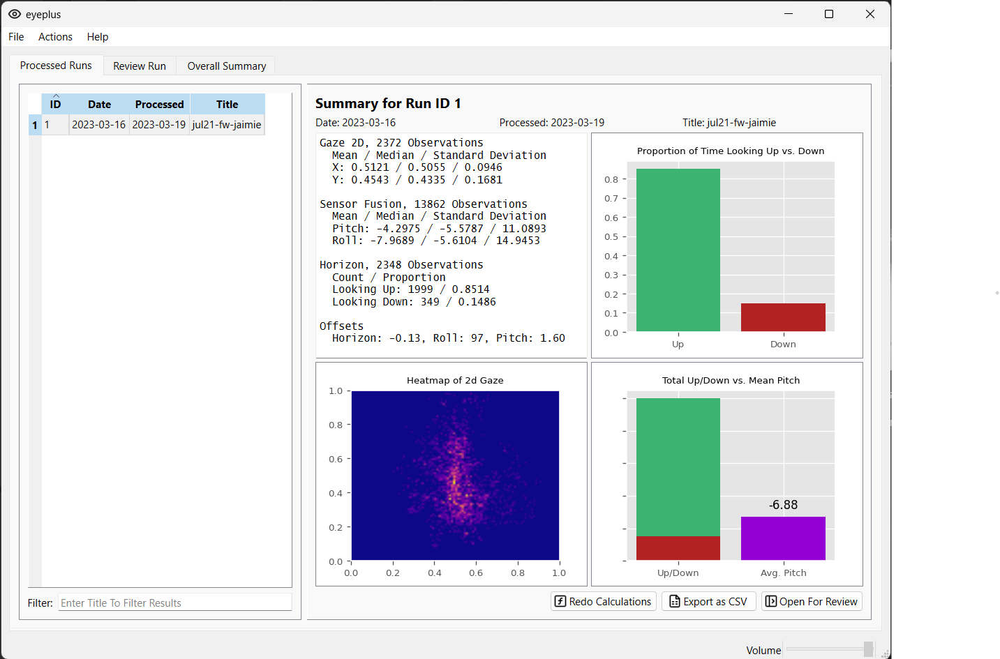

# Eyeplus

## Table of Contents

1. [Importing Data](#importing-data)
2. [Features](#additional-features)
3. [Troubleshooting](#troubleshooting)

## Importing Data

To import data into Eyeplus, follow these steps:

1. Click on the "File" menu in the top-left corner of the main application window.

2. Select "Import Zip" or "Import Folder" from the dropdown menu.

3. Browse to the location of your data folder and select the folder.

4. Wait for the data ingestion process to complete
5. Congratulations! You have successfully imported the data. The window will now open with the summary of the ingested data. 

## Features

## Troubleshooting

