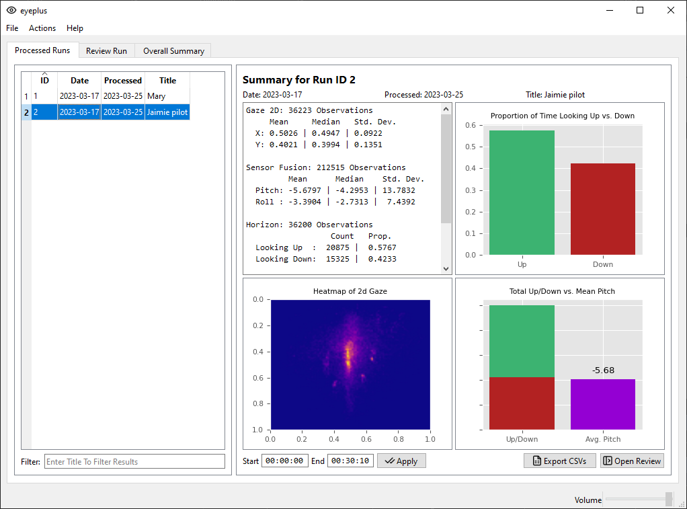

# eyeplus Usage

This guide will help to familiarize yourself with the eyeplus software and it's features and is aimed at Windows users who will use the installer to get it setup. It's recommmended new users start in Section 1 - Getting Started, which describes how to get setup and what to expect as you move through the interface. In the appendices, you will find some technical details regarding the software's capabilities.

## Table of Contents

1. [Getting Started](#getting-started)
   1. [Licensing Information](#licensing-information)
   2. [Data Collection](#data-collection)
2. [Importing Data](#importing-data)
   1. [Transferring Imported Data](#transferring-imported-data)
3. [Summary Review](#summary-review)
   1. [Left Pane (Summary)](#left-pane-summary)
   2. [Right Pane](#right-pane)
   3. [Command Bar](#command-bar)
4. [Review Run](#review-run)
   1. [Left Pane (Review)](#left-pane-review)
   2. [Video Pane](#video-pane)
   3. [Top Pane (Review)](#top-pane-review)
   4. [Bottom Toolbar](#bottom-toolbar)
      1. [Parameter Tuner](#parameter-tuner)
5. [Overall Summary](#overall-summary)
6. [Exporting Data](#exporting-data)
7. [Appendices](#appendices)

## Getting Started

If you haven't already, download and install the eyeplus installer, available via Github Releases. The installation process should be easy enough if you have ever used a wizard-style installer before. After it is finished, a desktop icon will be created, which will allow you to launch the program. If you ever lose this icon, the program is installed to `C:\Program Files\Makeplus\eyeplus\` (unless you have modified this location within Windows).

When you are ready to launch the program, double-click the icon. It may take several seconds to load the first time, depending on the speed of your system, as the software must complete some first-run tasks. When it is complete, you will be greeted with a small welcome screen, telling you to import some data. This process is detailed in Section 2 - Importing Data.

### Data Collection

**A special note on data collection:** In order to accurately compare the usage of a given mobility attachment/device, you must perform separate data collections. One using the attachment, and one not using it. If the files are combined, it is impossible for the software to provide numbers or statistics with any accuracy.

### Licensing Information

> eyeplus reads raw Tobii Pro 3 Glasses data to determine how much time a user spends looking at the horizon versus obstacles in their path.
>
> Copyright (C) 2023 Sasha Fey
>
> This program is free software: you can redistribute it and/or modify
> it under the terms of the GNU General Public License as published by
> the Free Software Foundation, either version 3 of the License, or
> (at your option) any later version.
>
> This program is distributed in the hope that it will be useful,
> but WITHOUT ANY WARRANTY; without even the implied warranty of
> MERCHANTABILITY or FITNESS FOR A PARTICULAR PURPOSE. See the
> GNU General Public License for more details.
>
> You should have received a copy of the GNU General Public License
> along with this program. If not, see [https://www.gnu.org/licenses/](https://www.gnu.org/licenses/).

## Importing Data

Before you start the process of importing data, first determine which option to use. eyeplus will import a .zip containing the files it needs, or it can work with folders. If you choose the folder import, it must be either a folder with directly contains the needed files, or a parent folder with subfolders containing all the necessary files. For the sake of clarity, these are the files that should be present.

_Once you have determined which option you are using, follow these steps to import data:_

1. Click **File** in the top menu bar.
2. Click either **Import Zip...**, or **Import Folder(s)...**. A standard Windows Explorer dialog will pop up.
3. Navigate to the location of folder/zip that you wish to import, then click **Open**. The main windows will dissapear, and a loading screen will display.

Now, all you have to do is wait. This process may take some time, especially on longer runs. When it is complete, the loading screen will dissapear, and the main window will be visible again, this time with the summary of the first run you imported. What all of this means is described in Section 3 - Summary Review.

### Transferring Imported Data

_If, by any chance, you would like to transfer your imported data to another system without waiting for it to be re-imported, follow these steps:_

1. Navigate to `C:\Program Files\Makeplus\eyeplus\` using Windows Explorer.
2. Copy the `data` folder to whatever storage medium you are using to transport it.
3. Locate the `C:\Program Files\Makeplus\eyeplus\` folder in the target system. If there is an existing `data` folder there, either delete it or back it up.
4. Copy the new `data` folder into the target system.

Next time you launch the software on the new system, it will load up exactly like the one on the original.

## Summary Review

The Summary Review Tab, or Processed Runs, is the default screen when starting up eyeplus. It displays a list of imported data, allowing you choose which one you would like to review, alongside programatically generated statistics and charts. It will look something like this.

### Left Pane (Summary)

The left pane displays a list of all imported runs. The date column indicates the date that the source files were last modified, while the Processed indicates the date the run was last processed/reprocessed.

At the bottom of the pane, you can enter text in order to filter by title, which may be useful if you have a lot of samples.

In order to select a run, simply single-click on it. You may notice some delay between the click and the updated data loading. This is normal and expected.

### Right Pane

The Right pane is composed of four panels, with a command bar along the bottom -- more on the later.

The **Top Left** panel displays summary statistics for the data in this run. This includes the mean, median, and standard deviation of Gaze 2D values, along with Roll and Pitch. The calculated looking up and looking down are presented as counts, along with total proportion. If you scroll down slightly, you will also see the current offset values -- also more on this later.

The **Top Right** panel displays a comparison between how much time a user spent looking up and down, based on the horizon line calculated by the software and the 2D gaze data.

The **Bottom Left** panel displays a heatmap of the user's 2D gaze data. Areas that are red/orange indicate a higher concentration of gaze points in these locations. The chart starts at (0,0) in the top left and ends in (1,1) on the bottom right. These coordinates correspond to points to which can be mapped onto the 2D video, by multiplying the width or height of the video by the x or y value.

The **Bottom Right** panel displays a comparison between the mean pitch of the user's head throughout the data collection with the stacked up/down calculations. Using this comparison alongside the heatmap can provide valuable insights into a user's gaze/head patterns.

### Command Bar

The command bar, located in the Summary Review (Processed Runs) tab, provides several options.

You have the option to enter a start and end time, which will affect which data points the software considers for it's statistics and visualizations of data. This can be useful if you wish to exclude a certain time, such as the beginning of the data collection, when calibrating is still taking place. To adjust this, simply enter your desired start/end time and click apply.

The **Export CSVs** button will help to export a series of CSV files for further analysis in other software, see Section 6 - Exporting Data for details on this.

The **Open Review** button will allow you to open a live Review Run, which includes a visual overlay, among other things. If you are ready to proceed to the next section, click this button.

## Review Run

After clicking the **Open Review** button in the previous tab, you will be greeted with a mostly blank tab. **Hit the \*Triangle Play Button** in the bottom toolbar to start the review. The video will start playing.

### Left Pane (Review)

The Left Pane displays raw text values, corresponding the current timestamp of the video. These are some of the values which are used to generate the overlay and live charts that you see.

### Video Pane

The video is displayed in this pane, with an overlay containing useful information for determining the accuray of the horizon line calculation.

The **Orange Dot** signifies the user's 2D gaze point at the given time, while the **Green Line** represents the calculated horizon line. The **Left Yellow Bar** is representation of the pitch of the user's head, with up meaning they are tilting their head back. Finally, the **Top Yellow Bar** indicates the roll value of the user's head, with left meaning that their head was tilting to the left.

**_Note: There may be a slight delay in seeing some of the overlay update versus the video. This is normal. The underlying calculations line up much more exactly._**

### Top Pane (Review)

The top pane display 3 live charts, which aim to provide insight on the user's gaze and head position during review.

The **Top Left** graphic displays a cumulative summary of the time spent looking up versus down. This is a running total of observations up until the current time in the video.

The **Top Middle** graphic plots the user's head pitch over time. The right-most point of the graph is the current timestamp in the video, and goes 10 seconds back in history.

The **Top Right** graphic plots the user's 2D Y gaze point over time. Like the previous one, the right-most part of the graph is the current timestamp in the video. The line change colours depending on whether the user is calculated to be looking up or down at that specific time. Green for looking up, Red for looking down.

### Bottom Toolbar

The bottom toolbar displays standard media player controls, where you can pause, stop, mute, or adjust the volume. The slider that is slightly above these controls also allows you to scrub through the video.

_Please note that if you click stop or playback ends, you must go back to the previous tab and click **Open Review** in order to start again._

The left-most button on this toolbar allows you to adjust some parameters related to the horizon calculation. If you would like to do this, click the button. A new window will open, where you can adjust them live while watching the video.

#### Parameter Tuner

The Parameter Tuner windows allows to adjust parameters related to the horizon line calculation, and can only be opened during Review Run. To adjust any of these parameters, simply click and hold the sliders, then click the **Apply** button.

The **Pitch Multiplier** provides a static multiplier to the calculated pitch values. This effectively controls how much the horizon line will move up or down depending on the pitch of the user's head. 1000 (default) corresponds to `1.0 x pitch`. When adjusting this value, the only immediate change will be the yellow bar representing pitch.

The **Pitch Offset** provides a static offset to the pitch values for the whole data collection. This may be useful if it's determined the the software believes the user's head is constantly pitched up or down when you believe it was not. These values are in degrees. When adjusting this value, the only immediate change will be the yellow bar representing pitch.

The **Horizon Offset** slider provides a static offset to the final calculated horizon line, moving it up or down. Higher values move the line up, while lower values move the line, with a maximum and minimum roughly corresponding to -25% / +25% of the video width. This values is immediately reflected in the horizon line in the video overlay.

Once you are happy with your adjustments, you can click the **Recalculate** button. This will close the current playback, and redo all horizon line and up/down calculations, storing them. Upon click Recalculate, a loading window will open. This will take some time, but after it is done you will be returned to the Summary Review (Processed Runs) tab, and can check how it affects the final result.

## Overall Summary

The Overall Summary tab allows to compare data between multiple runs, providing insight either between users, or between the same user during different data collections.

If you open the Overall Summary tab with only one or two runs imported, then those will displayed immediately. Otherwise, you must select one or more you wish to view. To do this, single click items (one at a time) that you wish to select in the **Bottom Left Pane**.

## Exporting Data

## Appendices
